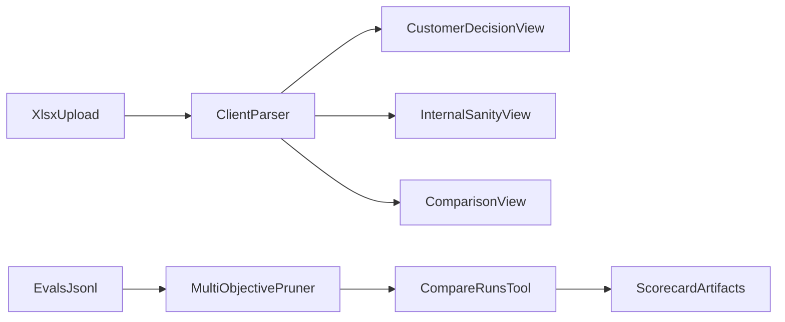

# AI Engineer — Model Quality & Performance Challenge (Submission)

**Task 1 Live URL:** `https://REPLACE_WITH_YOUR_VERCEL_URL`


This repository contains a complete submission for Cerebras Task 1 (Performance UI) and Task 2 (evalscope benchmark pruning).

## Quick verification (reviewers)

```bash
./reproduce.sh
```

Or:

```bash
make verify
```

Evidence outputs:

- `artifacts/scorecard.json`
- `artifacts/task2/compare_summary.json`
- `artifacts/task2/ablation.json`
- `artifacts/task2/encoder_probe_validation.json`

See also: [EVALUATION_FOR_REVIEWERS.md](./EVALUATION_FOR_REVIEWERS.md), [CLAIMS.md](./CLAIMS.md)

## Repository layout

| Path | Description |
|---|---|
| `task1-ui/` | React + Vite + TypeScript performance UI |
| `evalscope_ext/` | evalscope pruning/probe extension + tests |
| `docs/` | Handouts, methodology, requirement traceability |
| `artifacts/` | Generated validation outputs |

## Architecture



---

## Task 1 — Performance UI

### Run locally

```bash
cd task1-ui
npm ci
npm run dev
```

Build/test:

```bash
npm run build
npm run test
npm run test:e2e
```

### Deploy to Vercel (free)

1. Import repo in Vercel
2. Root directory: `task1-ui`
3. Build: `npm run build`
4. Output: `dist`
5. Paste deployed URL above and in submission form

Features:

- Upload one/many `.xlsx` sweeps (client-side parsing)
- Side-by-side model comparison
- Customer go/no-go + internal anomaly checks
- Data-driven model size / profile use-case inference panel
- No hard-coded model list (supports unseen `Model L`)

Details: [task1-ui/README.md](./task1-ui/README.md)

---

## Task 2 — Benchmark Compression (evalscope extension)

**evalscope base SHA:** `e9d42d8b6a8dcb937e042ba905e36eb05171ae0d`

Install:

```bash
cd evalscope_ext
pip install -e ".[dev]"
```

Run contract-compatible flow:

```bash
evalscope eval --model <model> --datasets live_code_bench --output ./results_full/
evalscope eval --model <model> --datasets live_code_bench_pruned \
  --dataset-args '{"pruning_strategy": "multi_objective", "prune_ratio": 0.1}' \
  --output ./results_pruned/
python3 -m evalscope_ext.tools.compare_runs --full ./results_full/ --pruned ./results_pruned/
```

Offline validation with shipped `Evals/` data:

```bash
python3 -m evalscope_ext.tools.generate_artifacts
python3 -m evalscope_ext.tools.ablation
python3 -m evalscope_ext.probe.mmmu_encoder_probe
pytest evalscope_ext/tests/
```

Details: [evalscope_ext/README.md](./evalscope_ext/README.md), [docs/task2_methodology.md](./docs/task2_methodology.md)

---

## Submission docs

- Handout A (technical): [docs/handout_a.md](./docs/handout_a.md)
- Handout B (mixed audience): [docs/handout_b.md](./docs/handout_b.md)
- Requirement traceability: [docs/requirement_traceability.md](./docs/requirement_traceability.md)
- Decision log: [docs/decision_log.md](./docs/decision_log.md)
- Limitations: [LIMITATIONS.md](./LIMITATIONS.md)

## Video walkthroughs

Add links after recording:

- Task 1 video: `<YOUR_TASK1_VIDEO_URL>`
- Task 2 video: `<YOUR_TASK2_VIDEO_URL>`

Scripts: [docs/video_script_task1.md](./docs/video_script_task1.md), [docs/video_script_task2.md](./docs/video_script_task2.md)

---

Original challenge instructions remain in [Task1_Performance.md](./Task1_Performance.md) and [Task2_Model_Quality.md](./Task2_Model_Quality.md).
